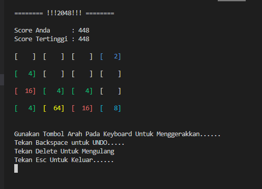

<h1>Game-2048</h1>

Game 2048 adalah permainan puzzle yang dimainkan pada grid 4x4 di mana pemain bertujuan untuk menggabungkan ubin-ubin dengan angka yang sama untuk mencapai angka 2048. Permainan tersebut dibuat menggunakan bahasa pemrograman C++ dengan memanfaatkan konsep pemrograman objek.

Struktur dasar dari permainan ini melibatkan representasi dari ubin-ubin di dalam grid. Setiap ubin memiliki nilai numerik yang merepresentasikan eksponensial dari angka 2 (dari 2 hingga 2048). Selama permainan, pemain dapat menggerakkan ubin-ubin ke atas, bawah, kanan, atau kiri. Ketika pemain melakukan gerakan, ubin-ubin akan bergabung jika mereka memiliki nilai yang sama. Gabungan ini akan menciptakan ubin baru dengan nilai yang merupakan hasil penjumlahan dari dua ubin yang bergabung.

Implementasi dalam C++ akan memanfaatkan konsep array atau struktur data untuk merepresentasikan grid dan algoritma untuk memindahkan dan menggabungkan ubin-ubin. Selain itu, dalam pembuatan game 2048, penggunaan perulangan dan kondisi akan menjadi krusial untuk mengatur logika permainan, seperti pengecekan kemenangan saat mencapai angka 2048 atau pengecekan apakah masih ada gerakan yang mungkin dilakukan oleh pemain.

Seringkali, dalam pengembangan game 2048, pemrogram menggunakan konsep rekursi atau algoritma pencarian seperti algoritma minimax untuk mencari strategi terbaik bagi komputer dalam memilih gerakan yang optimal.

Secara keseluruhan, implementasi game 2048 dalam C++ membutuhkan perpaduan antara logika permainan yang kompleks dengan konsep pemrograman yang kuat untuk mengelola grid, pergerakan ubin-ubin, dan penilaian strategi terbaik bagi pemain.

